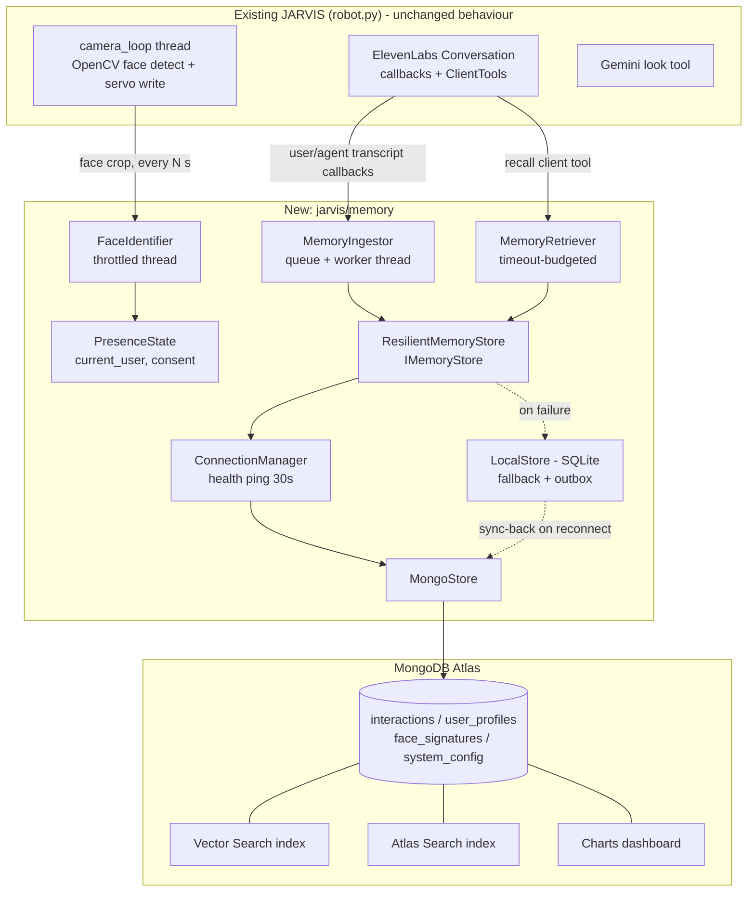

# Design Document: MongoDB Memory Store Integration

## Overview

This design adds persistent memory to JARVIS using MongoDB Atlas. JARVIS can remember past conversations, recognize returning people (with consent), and pull relevant context into the ElevenLabs voice agent. It targets the MLH "Best Use of MongoDB Atlas" prize and must never degrade the existing camera, servo, Gemini, or ElevenLabs behavior.

This revision refines the earlier draft to fit the actual codebase. `robot.py` is **thread-based and synchronous**: a camera thread, the ElevenLabs `Conversation` (which invokes sync callbacks and sync client tools), and a serial servo writer. Everything here is therefore synchronous with background worker threads. There is no `asyncio`.

### Design Goals
1. **Never break the robot.** Memory is an enhancement. Any memory failure degrades to memory-less operation (R6.5, R9).
2. **Never block the conversation or servo path.** Writes are queued, and reads run under a hard timeout budget (R7.1, R7.2).
3. **Privacy first.** Field-level encryption, consent-gated biometrics, anonymous-by-default interactions, and full deletion (R5).
4. **Hackathon-sized.** Demonstrate real Atlas features (Vector Search, Atlas Search, TTL indexes, `$jsonSchema` validation, Charts) without production-ops machinery.
5. **Shared foundation.** The `positivity-encouragement-bot` spec consumes this store for recognition and engagement metrics rather than building its own.

### Decisions Changed from the Earlier Draft

| Earlier draft | This design | Why |
|---|---|---|
| `async def` everywhere | Sync API + worker threads | `robot.py` and the ElevenLabs SDK callbacks are sync/threaded |
| `sentence-transformers` (384-d) | Gemini embedding API, dimension in config | Heavy local model; Gemini key already required. Model name and dimension are config (`EMBEDDING_MODEL`, `EMBEDDING_DIM`) and must be verified against `genai.list_models()` at implementation time |
| `face_recognition`/dlib default | Pluggable `FaceSignatureProvider`; default OpenCV `FaceRecognizerSF` (ONNX); dlib optional | dlib builds are painful on the Windows demo machine (`COM3` in `robot.py`) |
| Vector index on face embeddings | Face embeddings encrypted; matched in-process with cosine similarity | Encrypted vectors can't be indexed. Scale is tens of people, so an in-memory cache is enough |
| Prometheus, PagerDuty, VPC peering, sharding, Redis, WAL | Removed (see "Out of Scope") | Not achievable or useful in a hackathon |
| Atlas Data API in the prize checklist | Dropped | MongoDB announced deprecation of the Data API in 2025. Verify current status; the design does not depend on it |
| Per-user encryption keys | One Fernet key, `key_id` recorded per document | Keeps rotation possible without a key service |

## Architecture



### Threading Model

| Thread | Owner | Touches memory? | Rule |
|---|---|---|---|
| `camera_loop` | existing | Only `PresenceState.get()` (lock-free read) and `FaceIdentifier.submit(crop)` (non-blocking, drops if busy) | Face tracking and servo writes never wait on memory (R6.4) |
| ElevenLabs callback thread | SDK | `MemoryIngestor.enqueue()` (non-blocking `put_nowait`) | Return immediately |
| Client-tool thread | SDK | `MemoryRetriever.recall()` | Hard 500 ms budget, returns `""` on timeout |
| `ingestor-worker` | new | Validate, scrub, encrypt, embed, write | All slow work lives here |
| `face-identifier` | new | Embed face, match, update `PresenceState` | Runs at most once per 2 s, or when a new face track starts |
| `conn-health` | new | `ping` every 30 s, drives online/degraded state, triggers outbox sync | Daemon thread |

All threads are `daemon=True`, matching `robot.py`.

## Components

### 1. Configuration (`jarvis/memory/config.py`)
`MemoryConfig.from_env()` reads from environment / `.env` (already loaded by `python-dotenv`) and validates at startup with actionable messages (R10.1, R10.3, R10.4).

| Variable | Required | Default | Purpose |
|---|---|---|---|
| `MONGODB_ATLAS_URI` | no* | none | Atlas connection string. If absent, the store starts in local-only mode and logs why |
| `MONGODB_DB` | no | `jarvis` | Database name (per environment: `jarvis_dev`, `jarvis_demo`) |
| `ENCRYPTION_KEY` | yes if any persistence | none | Fernet key. Generated by `scripts/gen_key.py`; startup fails loudly rather than storing plaintext PII |
| `EMBEDDING_MODEL` / `EMBEDDING_DIM` | no | verified at implementation | Gemini embedding model and dimension |
| `RETENTION_DAYS` | no | `90` | TTL for interactions |
| `PROFILE_RETENTION_DAYS` | no | `180` | Inactivity period after which profiles and face signatures are purged |
| `FACE_GREET_THRESHOLD` | no | `0.5` (SFace cosine) | Higher bar required before JARVIS greets someone *by name* |
| `LOCAL_FALLBACK_PATH` | no | `./data/fallback.sqlite3` | SQLite file (gitignored) |
| `FACE_MATCH_THRESHOLD` | no | `0.363` (SFace cosine) | Tunable per environment |
| `MEMORY_ENABLED` | no | `true` | Kill switch. `false` gives exact legacy behaviour |

`*` Missing URI is a valid degraded mode, not a crash. A malformed URI or missing key with persistence enabled is a startup error.

### 2. Connection Manager (`ConnectionManager`) (R1, R9.1, R9.3, R9.5)
- Builds one `pymongo.MongoClient` (thread-safe, pooled) with `serverSelectionTimeoutMS=2000`, TLS from the `mongodb+srv` URI.
- State machine: `ONLINE`, `DEGRADED` (recent failures), `OFFLINE` (fallback active).
- `conn-health` thread pings every 30 s. Transition to `OFFLINE` after 3 consecutive failures. Return to `ONLINE` triggers `outbox.replay()`.
- `with_retry(fn)` implements exponential backoff (`1.5 ** attempt`, max 3 tries) for transient `pymongo` errors, then raises `ConnectionFailure` to the caller. It does not itself fall back, so fallback policy lives in one place (`ResilientMemoryStore`).
- Exposes `health() -> HealthStatus` (state, last_ping_ms, consecutive_failures, outbox_depth, last_error). Surfaced via a log line every 60 s and the demo CLI (R9.5).

### 3. Stores
`IMemoryStore` (sync):

```python
class IMemoryStore(Protocol):
    def store_interaction(self, rec: InteractionRecord) -> str: ...
    def retrieve_context(self, query: str, user_id: str | None = None, limit: int = 5) -> list[InteractionRecord]: ...
    def store_user_profile(self, profile: UserProfile) -> str: ...
    def get_user_profile(self, user_id: str) -> UserProfile | None: ...
    def associate_face(self, signature: FaceSignature, user_id: str) -> bool: ...
    def identify_user(self, signature: FaceSignature) -> tuple[str, float] | None: ...  # (user_id, score)
    def delete_user_data(self, user_id: str) -> DeletionReport: ...
    def purge_expired(self) -> int: ...
    def health(self) -> HealthStatus: ...
```

- **`MongoStore`**: PyMongo implementation, `$jsonSchema` validators on collections (defense in depth alongside app-side validation), Vector Search and Atlas Search queries.
- **`LocalStore`**: SQLite (stdlib, `check_same_thread=False`, one `threading.Lock`). Holds the same encrypted documents as JSON. **Retrieval is recency + keyword only** (no semantic ranking; see analysis). Also holds the `outbox` table.
- **`ResilientMemoryStore`**: the only class the rest of the code imports. Routing:
  - Writes: try Mongo via `with_retry`. On failure, write to `LocalStore` and append to the outbox. Client-generated `_id` (UUID) makes `outbox.replay()` idempotent via upsert (no duplicates, no loss).
  - Reads: Mongo when `ONLINE`; otherwise `LocalStore`. Never raises to callers. Errors are logged and an empty result is returned (R9.2).

### 4. Ingestor (`MemoryIngestor`) (R2, R5.3, R7.2, R8)
Pipeline (worker thread), one record at a time from a bounded `queue.Queue(maxsize=200)` (drop-oldest with a logged warning if full, so a stalled DB can't exhaust memory):

1. **Assemble** `InteractionRecord` from callbacks: pairs the latest `callback_user_transcript` with the next `callback_agent_response`; adds session_id, timestamp, `PresenceState` snapshot, and optional `gemini_analysis` (the `look` tool result, if one fired in that turn).
2. **Validate** against JSON schema (R8.1, R8.3). Failures are logged with the reason and dropped (never crash).
3. **Scrub** best-effort PII redaction for anonymous records (emails, phone numbers) with regexes (R5.3).
4. **Classify** `privacy_level` (`public`, `personal`, `sensitive`) with cheap keyword rules plus consent state. Sensitive records are **not embedded**.
5. **Embed** via Gemini embedding API with a 3 s timeout. On failure the record is stored with `embedding_pending: true` and a background backfill picks it up later.
6. **Encrypt** PII fields (Fernet): `input_text`, `ai_response`, `voice_transcript`, `personalization_data.name`, `face_signature`. Record `key_id`.
7. **Write** through `ResilientMemoryStore`.

Anonymous-by-default: until a person consents, records carry `user_id = null` and no face link. Once consent is given mid-session, later records link to the profile. Earlier anonymous records from the same `session_id` are not retro-linked (R5.2).

### 5. Retriever (`MemoryRetriever`) (R4, R7.1)
`recall(query, user_id) -> str` (formatted context string, `""` if nothing/timeout). Total budget **500 ms**, enforced by running the work on a small `ThreadPoolExecutor` and `future.result(timeout=0.5)`.

1. Path A, semantic: embed the query (300 ms cap), then Atlas `$vectorSearch` on `interactions.embedding` with a pre-filter on `user_id` (if known) and `privacy_level`.
2. Path B, lexical (if embedding times out or fails): Atlas Search `$search` text query on the plaintext `context.topics` and `context.entities` fields. Message bodies are encrypted, so topics and entities (extracted at ingest by keyword rules) are the searchable surface. **They come from a fixed vocabulary of non-personal keywords; person names and contact details never enter these plaintext fields.**
3. Path C, recency: latest N for the user from `LocalStore` or Mongo.
4. **Rank**: `score = 0.7 * similarity + 0.3 * exp(-age_days / 14)`. Temporal half-life is configurable (R4.2).
5. **Privacy filter** (runs last, in code, not just in the query): drop `sensitive` records unless the profile has `consents.use_for_personalization = true`. Never return another user's records.
6. Decrypt only the selected top-K, and return a compact bullet list (max ~600 chars) to keep the agent prompt small.

### 6. Face Recognition (`FaceSignatureProvider`, `FaceIdentifier`) (R3)
- `FaceSignatureProvider.signature(face_crop) -> np.ndarray | None`. Default `OpenCVSFaceProvider` (128-d, `cv2.FaceRecognizerSF`, ONNX model file downloaded once by `scripts/fetch_models.py`). Optional `DlibProvider`.
- `FaceIdentifier` runs on its own thread, fed by `camera_loop` with the largest-face crop at most every 2 s or when a face newly appears. It:
  - computes a signature, then `identify_user()` via cosine similarity against the cached, decrypted signatures of **consented** users only (cache loaded at startup and updated on `associate_face`);
  - only accepts a match at `>= FACE_MATCH_THRESHOLD` **and** requires 2 consecutive agreeing matches before setting `PresenceState.user_id` (false-match guard). `PresenceState.may_greet_by_name` is true only when the score is also `>= FACE_GREET_THRESHOLD`; below that, JARVIS behaves as if the person is unknown, which avoids greeting a stranger with someone else's name;
  - publishes `PresenceState(user_id, name?, consent, confidence, since)`. Unknown faces publish `user_id=None`.
- Raw crops are never persisted. Only the encrypted embedding is stored, and only with `consents.store_face_data = true`.

### 7. Consent and Deletion by Voice (R5.2, R5.4)
Consent must work without a keyboard (also matches the positivity spec's non-chatbot rule). Three ElevenLabs **client tools** are registered next to `look`:

| Tool | Agent uses it when | Effect |
|---|---|---|
| `recall(query)` | The user references the past, or at conversation start for a known user | `MemoryRetriever.recall` |
| `remember_me(confirmed: bool)` | The agent has asked "Want me to remember you next time?" and the user answered | Creates `UserProfile` with `store_face_data`, `store_personal_data`, `use_for_personalization` set; associates the current face signature |
| `forget_me()` | The user asks to be forgotten | `delete_user_data(current_user)`, clears `PresenceState` and the cache. Returns a spoken confirmation |

One **external step** (not code): the ElevenLabs agent's system prompt in the ElevenLabs dashboard must be updated to describe these tools and the consent wording. This is tracked as an explicit task.

### 8. Deletion and Retention (R5.4, R5.5)
- `delete_user_data`: deletes the profile, face signatures, and all interactions with that `user_id` from Mongo **and** LocalStore **and** pending outbox items; returns a `DeletionReport` with counts. Idempotent.
- Retention: `expires_at` field on interactions and a MongoDB **TTL index** (`expireAfterSeconds=0`) so Atlas purges automatically. `LocalStore.purge_expired()` runs at startup and hourly.
- Profile retention: profiles (and their face signatures) whose `interaction_stats.last_interaction` is older than `PROFILE_RETENTION_DAYS` are deleted by the same routine as `delete_user_data`, run at startup and daily. Open question for the team (see `analysis.md`).

## Data Models

All documents carry `schema_version` (R8.4), `_id` (client-generated UUID string, so writes are idempotent), and `key_id` when any field is encrypted. `enc(...)` marks a Fernet-encrypted field.

### `interactions`
```json
{
  "_id": "uuid",
  "schema_version": "1.0",
  "timestamp": "ISODate",
  "expires_at": "ISODate",
  "session_id": "uuid",
  "user_id": "uuid | null",
  "face_signature_id": "uuid | null",
  "input_text": "enc(string)",
  "ai_response": "enc(string)",
  "voice_transcript": "enc(string)",
  "gemini_analysis": { "summary": "string", "source": "look" },
  "context": { "topics": ["string"], "sentiment": "pos|neu|neg", "entities": ["string"] },
  "embedding": "[float] (EMBEDDING_DIM) | null",
  "embedding_pending": "bool",
  "privacy_level": "public | personal | sensitive",
  "metadata": { "source": "voice", "confidence": "float | null" },
  "key_id": "string"
}
```

### `user_profiles`
```json
{
  "_id": "uuid",
  "schema_version": "1.0",
  "created_at": "ISODate", "updated_at": "ISODate",
  "display_name": "enc(string) | null",
  "preferences": {
    "conversation_style": "formal | casual | technical",
    "topics_of_interest": ["string"], "avoid_topics": ["string"]
  },
  "interaction_stats": {
    "total_interactions": "int", "first_interaction": "ISODate",
    "last_interaction": "ISODate", "visit_count": "int"
  },
  "consents": {
    "store_personal_data": "bool", "store_face_data": "bool",
    "use_for_personalization": "bool", "granted_at": "ISODate"
  },
  "is_active": "bool", "key_id": "string"
}
```

### `face_signatures`
```json
{
  "_id": "uuid", "schema_version": "1.0",
  "user_id": "uuid",
  "embedding": "enc(base64 float32 x 128)",
  "metadata": { "method": "sface|dlib", "detection_confidence": "float", "created_at": "ISODate" },
  "key_id": "string"
}
```
No image hash or image is stored. No vector index (see the decisions table).

### `system_config`
`{ "_id": "retention|indexes|schema", "settings": {}, "schema_version": "string", "last_modified": "ISODate" }`. Records the applied schema version and migration history (R8.2).

### Schema Validation and Migration (R8)
- App-side: `jsonschema` validation per collection before any write. Mongo-side: `$jsonSchema` validator with `validationAction: "error"` set by `scripts/provision.py`.
- Migrations: `MIGRATIONS: dict[tuple[str, str], Callable[[dict], dict]]`, applied lazily on read (`upgrade(doc)`) and in a one-shot `scripts/migrate.py`. Pure functions, so they are property-testable (Property 13).

### Indexes (`scripts/provision.py`, idempotent)
| Collection | Index | Purpose |
|---|---|---|
| `interactions` | `{user_id: 1, timestamp: -1}` | Timeline and recency path |
| `interactions` | `{expires_at: 1}`, `expireAfterSeconds: 0` | TTL retention |
| `interactions` | Atlas **Vector Search** `interactions_vec`: `embedding`, `EMBEDDING_DIM`, cosine, filter fields `user_id`, `privacy_level` | Semantic retrieval |
| `interactions` | Atlas **Search** `interactions_text`: `context.topics`, `context.entities` | Lexical path |
| `user_profiles` | `{updated_at: -1}` | Active users |
| `face_signatures` | `{user_id: 1}` | Delete-by-user, cache load |

## Error Handling (R9)

```python
class MemoryStoreError(Exception): ...
class StoreConnectionError(MemoryStoreError): ...   # renamed: avoids shadowing builtin ConnectionError
class ValidationError(MemoryStoreError): ...
class PrivacyError(MemoryStoreError): ...
class FallbackError(MemoryStoreError): ...
```

- **Public boundary never raises.** `MemoryIngestor.enqueue`, `MemoryRetriever.recall`, and `FaceIdentifier.submit` catch everything, log a structured error (operation, record id, exception type, cause, timestamp; no plaintext PII), and return a neutral value (R9.2).
- **Integrity** (R2.4, R9.4): idempotent upserts, outbox replay, and a per-document SHA-256 checksum of the plaintext fields stored beside the ciphertext. On read, a Fernet decrypt failure or checksum mismatch marks the document `corrupt: true`, skips it in results, and logs it. Recovery is "use fallback copy if present", otherwise skip.
- **Alerting** (R9.5): a health line is logged every 60 s. If the failure rate over the last 50 operations exceeds 20% or the state stays `OFFLINE` for more than 5 minutes, an `ERROR`-level log line is emitted. That is the hackathon-scale alert; wiring it to Slack or PagerDuty is out of scope.

## Integration with `robot.py` (R6)

The changes to `robot.py` are additive and gated by `MEMORY_ENABLED`:

```python
# after load_dotenv()
from jarvis.memory import build_memory          # returns a no-op NullMemory when disabled/unavailable
memory = build_memory()                          # never raises

# camera_loop: after detecting `faces`, one extra non-blocking line
memory.identifier.submit(frame, (x, y, fw, fh))  # no-op if busy

# ClientTools
tools.register("recall",      lambda p: memory.retriever.recall(p.get("query", ""), memory.presence.user_id))
tools.register("remember_me", lambda p: memory.consent.remember(p.get("confirmed", False)))
tools.register("forget_me",   lambda p: memory.consent.forget())

# Conversation callbacks: wrap the existing lambdas
callback_agent_response=lambda t: (print("JARVIS:", t), memory.ingestor.on_agent(t)),
callback_user_transcript=lambda t: (print("You:", t), memory.ingestor.on_user(t)),
```

`NullMemory` implements the same surface with no-ops, so disabling or failing to initialize memory yields exactly today's behaviour (R6.1-6.5). The existing `look` tool is unchanged apart from optionally publishing its result to `memory.ingestor.on_gemini(text)`.

## Testing Strategy

| Layer | Tooling | Scope |
|---|---|---|
| Property-based | `hypothesis` + `pytest` | Pure logic: schema validation, encryption round-trip, migrations, ranking, privacy filter, outbox idempotence, `PresenceState` false-match guard |
| Unit / example | `pytest`, `mongomock` | `LocalStore`, `ResilientMemoryStore` routing, ingestor pipeline with fakes for Gemini and Mongo, config validation |
| Integration | `pytest -m atlas`, real Atlas M0 test DB, skipped unless `MONGODB_ATLAS_URI_TEST` is set | Connection, TTL, `$jsonSchema`, `$vectorSearch`, `$search`, outbox replay after simulated outage |
| Smoke | `scripts/smoke.py` | Startup with and without URI, and with a bad key; confirms `robot.py` still starts with `MEMORY_ENABLED=false` |
| Manual | Demo checklist | Hardware in the loop: servo tracking unaffected while memory is `OFFLINE` |

`mongomock` does not support `$vectorSearch` or `$search`, so those paths are covered only by the Atlas-marked integration tests and a fake retriever backend for unit tests. Property tests run at 100 examples with a 5 s deadline.

## Correctness Properties

*A property is a characteristic that should hold across all valid executions. These are implemented as Hypothesis tests. Requirement references use the numbering in `requirements.md`.*

1. **Connection failure degrades gracefully.** For any failure mode (timeout, auth, DNS, network), storing an interaction logs the error, lands the record in `LocalStore` and the outbox, and raises nothing. *Validates R1.2, R6.5, R9.1*
2. **Round-trip integrity.** For any valid `InteractionRecord`, store then retrieve returns equal plaintext fields. *Validates R2.1, R2.2, R2.4, R8.4*
3. **Face-conversation association.** For any interaction with a matched, consented face, the stored record carries the `user_id`/`face_signature_id`, and retrieval preserves it. For unconsented faces, neither field is ever set. *Validates R2.3, R3.2, R5.2*
4. **PII encryption.** For any PII field, the stored value differs from the plaintext, decrypts to the original with the right key, and fails to decrypt with any other key. *Validates R1.4, R5.1*
5. **Signature stability.** The same face input yields the same signature (within epsilon), and clearly different inputs stay below the match threshold. *Validates R3.1*
6. **Profile retrieval.** For a recognized user, `get_user_profile` returns that user's profile and never another's. *Validates R3.3*
7. **Privacy-aware filtering.** For any mix of `privacy_level` and consent state, the retriever output never contains a `sensitive` record without `use_for_personalization`, and never contains another user's record. *Validates R4.4, R5.2*
8. **Anonymization preserves function.** For any text containing an email or phone number, the scrubbed output contains neither, and its non-PII tokens are unchanged. *Validates R5.3*
9. **Complete deletion.** After `delete_user_data(u)`, no document in Mongo, `LocalStore`, or the outbox references `u`, and other users' data is untouched. *Validates R5.4*
10. **Retention.** For any set of records and a clock, `purge_expired` removes exactly those past `expires_at`. *Validates R5.5*
11. **Concurrency safety.** For any interleaving of concurrent stores, reads, and deletes across threads, no exception escapes, no record is duplicated, and post-quiescence state equals a valid sequential outcome. *Validates R7.5*
12. **Schema validation completeness.** For any generated document, it is accepted iff it satisfies the schema. *Validates R8.1, R8.3*
13. **Migration compatibility.** For any v(n) document, `upgrade` yields a valid v(n+1) document that preserves all v(n) semantic fields. *Validates R8.2*
14. **Error logging completeness.** For any injected write failure, exactly one structured error entry is logged with operation, record id, cause, and timestamp, and the record is not lost. *Validates R9.2*
15. **Configuration validation.** For any environment state, `MemoryConfig.from_env` either returns a valid config or raises one error listing every missing or invalid variable. *Validates R10.3, R10.4*
16. **Outbox idempotence** (new). Replaying the outbox any number of times after any partial failure yields exactly one copy of each record in Mongo. *Validates R2.4, R9.1, R9.3*
17. **Bounded latency** (new). For any retriever backend behavior, including hangs, `recall` returns within the 500 ms budget plus scheduling slack, and returns `""` when it times out. *Validates R6.5, R7.1*

## Atlas Prize Demonstration Plan

| Atlas feature | Where used | Demo artifact |
|---|---|---|
| Vector Search | Semantic recall of past conversations | "Ask about something from an earlier session" live |
| Atlas Search | Lexical fallback over topics and entities | Same demo with embeddings disabled |
| TTL indexes | Automatic retention | Show `expires_at` and the index |
| `$jsonSchema` validation | Server-side schema enforcement | Show a rejected insert |
| Charts | Interactions per day, top topics, returning visitors, fallback events | Embedded dashboard screenshot |
| Offline resilience | Outbox sync-back | Pull the network cable, keep talking, reconnect, watch records appear |
| (Stretch) Queryable / client-side field-level encryption | Replace app-level Fernet | Only if time permits (requires libmongocrypt) |

## Out of Scope (Hackathon)
Prometheus and distributed tracing, PagerDuty or Slack alerting, VPC peering, sharding and read replicas, Redis caching, a WAL, per-user key management, multi-robot sync, and the Atlas Data API.

## Security Notes
- No credentials in source (R10.4). `.env` is gitignored. Key generation and rotation are documented in `scripts/gen_key.py`.
- `.gitignore` currently begins with a UTF-8 BOM before `.env`. It works today, but rewrite it without the BOM so the ignore rule can't silently stop matching.
- The Atlas Network Access list should be limited to the demo machine's IP, not `0.0.0.0/0`.
- Logs never include plaintext transcripts or embeddings.

## Dependencies (`requirements.txt`, new file)
```
pymongo[srv]>=4.6
cryptography>=42
jsonschema>=4
google-generativeai        # already used; embeddings via genai.embed_content
opencv-python>=4.8         # FaceRecognizerSF; already used by robot.py
numpy
python-dotenv
# test
pytest>=8
hypothesis>=6
mongomock>=4
```
Optional: `face-recognition` (dlib). The existing imports (`elevenlabs`, `pyserial`) are unchanged.

## Migration Phases
1. **Foundation**: config, errors, schemas, crypto, `LocalStore`, `ResilientMemoryStore`, `NullMemory`. The robot runs unchanged.
2. **Write path**: ingestor wired to ElevenLabs callbacks, Mongo store, outbox.
3. **Read path**: retriever (recency, then lexical, then vector), `recall` tool, agent prompt update.
4. **Identity**: face signatures, consent tools, deletion.
5. **Prize polish**: index provisioning, Charts, demo script, outage demo.
