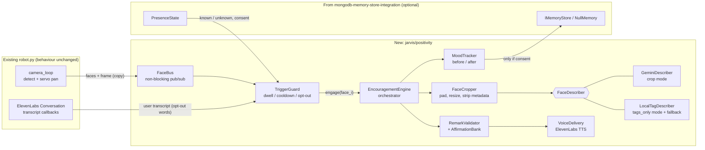

# Design Document: Positivity & Encouragement Bot

## Overview

This feature turns JARVIS from a voice assistant into an autonomous confidence-building companion for the Microsoft "What's Missing?" challenge. When a person steps in front of the robot, JARVIS notices them, tells them what it is about to do and how to opt out, looks at their face, and speaks warm, specific, safe remarks about what it sees. No chat window or keyboard is involved. The robot then checks whether the person looks more positive afterwards.

The "roast bot, flipped" concept in `CLAUDE.MD` maps to a hybrid approach: Gemini writes the remark, a deterministic validator guarantees it is safe, and a curated affirmation bank is the fallback.

### Design Goals
1. **Autonomous and non-chat** (R4). Face in, kind words out, with physical presence and voice as the only interface.
2. **Safe by construction** (R1.3-1.5, R9). An LLM is never trusted to be respectful on its own. Its output passes a deterministic validator, and a curated bank backs it up.
3. **Honest privacy** (R6). The design states exactly what leaves the device and offers a strict local-only mode.
4. **Fast** (R10). A person should hear the first words within 5 s of being detected.
5. **Never break the robot** (R8). Any failure in this feature means silence, not a crash. Face tracking and servos are untouched.
6. **Measurable** (R5). Before/after scores and engagement counters produce evidence for the judges.

### Key Design Decisions

| Decision | Choice | Rationale |
|---|---|---|
| What Gemini sees | **Default `crop` mode:** a single padded face crop (≤256 px, in memory only, no metadata). **`tags_only` mode:** no image at all; only text tags from local OpenCV cascades | Haar face detection alone yields a bounding box, so it cannot say "warm smile". `crop` gives specific, honest remarks. `tags_only` satisfies R6.2 *literally* (Gemini receives descriptions, not images). Both are implemented behind one interface, and `tags_only` is also the fallback when the Gemini call fails |
| Multi-face | One independent analysis per face crop, at most 3 faces per round, delivered left-to-right | R2.3 (separate remarks) and no cross-contamination between people |
| Trigger | A `TriggerGuard` state machine (dwell, cooldown, opt-out) | R4.2 says "when a face is detected". Without a guard the robot would speak every frame |
| Opt-out | Spoken notice, then a 2 s window in which a spoken "no" / "stop" cancels; sticky per person and per session | R6.5 without a keyboard (R4.3) |
| Persistence | Stateless by default. Anything stored goes through the MongoDB spec's consent flow (`IMemoryStore`) | R6.3. Also avoids a second data store (R8.2) |
| Voice output | `VoiceDelivery` interface. Default: ElevenLabs text-to-speech streamed to the speakers with voice settings tuned for warmth. Delivery method for unprompted speech next to the open agent session is settled by a spike (see Open Technical Questions) | The ElevenLabs conversation agent is reactive; it does not speak unprompted |
| Output safety | Structured JSON from Gemini → deterministic `RemarkValidator` → one retry with a stricter prompt → curated fallback bank | R1.3-1.5, R2.4, R9 |

## Architecture



### Threading Model
- `camera_loop` (existing) publishes `(frame_copy, faces)` to `FaceBus` with a non-blocking `put_nowait` on a size-1 queue (latest wins). It does nothing else new. Servo writes are unchanged (R8.1, R8.4, R10.3).
- One `encourage-worker` thread consumes bus events, runs the guard, and executes the sequence. Per-face Gemini calls run on a `ThreadPoolExecutor(max_workers=3)`.
- Voice playback runs on its own thread so the worker can continue with the after-check timing.
- All threads are `daemon=True`. Every top-level function in these threads is wrapped in a catch-all that logs and returns to idle (R8.5).

## Components

### 1. FaceBus and camera hook (R4.2, R8.2)
A minimal refactor of `camera_loop`: after `detectMultiScale`, publish `FaceEvent(frame, faces[], ts)`. Existing tracking (`max(faces, key=area)` → pan → serial write) is not modified. The bus is the extension point shared with the memory spec's `FaceIdentifier`.

### 2. TriggerGuard (R4.2, R10.1, R6.5)
States per tracked person (tracks are associated by bounding-box overlap between frames, IoU ≥ 0.3; there is no identity involved unless the memory spec recognizes them):

```
IDLE --face seen--> DWELL --stable ≥ 1.0 s--> NOTICE --2 s no opt-out--> ENGAGED --done--> COOLDOWN
                        |                         |                                           |
                  face lost < 0.5 s        opt-out heard                          face absent ≥ 5 s → IDLE (new person eligible)
                        v                         v                               same recognised person: wait COOLDOWN_MIN (default 10 min)
                      IDLE                     OPTED_OUT (absorbing for this person/session)
```

- **Dwell** ≥ 1.0 s avoids reacting to passers-by and false detections, and still lets analysis begin inside R10.1's 2 s.
- **Walking away is an opt-out.** If a face's track is lost for ≥ 0.5 s during NOTICE, that face is dropped from the round. This gives people who cannot or prefer not to speak (or whose speech the microphone misses in a noisy hall) a non-verbal way to decline.
- **Cooldown**: a track that stays in frame is not re-engaged. A recognized person (via `PresenceState`, if memory is on) is not re-engaged within `COOLDOWN_MIN`. Unrecognized people can be re-engaged only after a 5 s absence.
- **Global rate limit**: at most one engagement round per 20 s, so a crowd cannot cause a monologue loop.
- **Opt-out** words come from `callback_user_transcript`: `no`, `no thanks`, `stop`, `don't`, `go away`, `not now`, `quiet`. Matching is on whole words, case-insensitive. Speech cannot be attributed to a particular face, so an opt-out heard during a round applies to **every face in that round** (the conservative choice). A spoken "stop" also disables the feature for the session (`enabled = False`) until the process restarts.
- **Nothing face-derived leaves the device before the NOTICE window closes without an opt-out.** The transition NOTICE → ENGAGED is the only point at which a crop may be sent anywhere.
- **Kill switch**: `POSITIVITY_ENABLED=false` makes the entire package a no-op.

### 3. Notice (R6.5)
A short, warm, non-negotiable line before analysis: e.g. "Hi! I'd like to say something kind about you. Say 'no thanks' if you'd rather I didn't." Delivered through `VoiceDelivery`. A printed sign next to the robot states the same thing and what data is used. The on-screen OpenCV preview window also shows a small "Positivity: listening for opt-out" indicator.

### 4. FaceCropper (R6.1)
`crop_face(frame, box) -> bytes`:
- pads the box by 20%, clamps to the frame, resizes so the longest side ≤ 256 px, JPEG-encodes with `cv2.imencode` (which writes no EXIF or location metadata);
- returns bytes **in memory only**; nothing is written to disk and no frame is logged;
- the analyzer interface accepts only this type, never a full frame. This is enforced by type and covered by a test (Property 4).

### 5. FaceDescriber (R1)
```python
class FaceDescriber(Protocol):
    def describe(self, face: FaceInput) -> FaceDescription: ...

@dataclass
class FaceDescription:
    observations: list[Observation]   # feature in ALLOWED_FEATURES, plus short detail text
    remark: str | None                # proposed spoken remark (crop mode only)
    smile_score: float                # 0..1
    expression_score: float           # 0..1 (open, relaxed, engaged)
    source: Literal["gemini", "local"]
```

**`GeminiDescriber`** (crop mode). One call per face using the existing `gemini` model object, with `response_mime_type="application/json"` and a response schema. The prompt is fixed text checked into `jarvis/positivity/prompts.py`:
- *Allowed features* (`ALLOWED_FEATURES`): `smile`, `expression`, `eyes` (expressiveness, warmth, brightness), `presence` (energy, calm, confidence conveyed by expression), `style` (glasses, hat, clothing colour or pattern).
- *Forbidden topics*: age or apparent age, weight or body shape, skin tone, ethnicity or race, gender or sex (including gendered words and pronouns), disability or health, attractiveness rankings, comparisons to other people or to "average", and anything negative or backhanded.
- Requires ≥ 3 observations, each with a feature from the allowed list, and a remark of 1-3 short sentences that refers to at least one of those observations.
- Instructs the model to address the person as "you" and never to guess names.

**`LocalTagDescriber`** (`tags_only` mode and fallback). Uses OpenCV's bundled cascades on the face region: `haarcascade_smile.xml` (smile), `haarcascade_eye.xml` (eyes open and bright), `haarcascade_eye_tree_eyeglasses.xml` (glasses), plus head-tilt from eye positions and framing (leaning in / centred). It yields the same `FaceDescription` shape but with `remark=None`. The remark is then assembled from the `AffirmationBank` templates keyed by the tags (`smile`, `eyes`, `glasses`, `presence`), and Gemini, if used at all, receives only the text tags ("smile: yes; eyes: open, bright; glasses: yes") and returns a warm rewrite. Accuracy of these cascades is modest, so `tags_only` remarks are simpler. That is the intended trade for the strictest privacy setting.

Mode is chosen by `POSITIVITY_PRIVACY_MODE = crop | tags_only` (default `crop`).

### 6. RemarkValidator and AffirmationBank (R1.3-1.5, R2.4, R2.5, R9)
`validate(description) -> ValidationResult(ok, reasons[])` is a **pure function**, with no I/O and no model calls:

| Check | Rule |
|---|---|
| Feature allow-list | every observation's feature ∈ `ALLOWED_FEATURES`; at least 3 distinct observations (R1.2) |
| Specificity | the remark must reference ≥ `POSITIVITY_MIN_REFERENCED` (default **2**) distinct observed features via each feature's keyword set (R2.4). Purely generic remarks ("You're amazing!") fail. The bank composes at least this many templates |
| Sensitive-category deny-list | whole-word, case-insensitive, matched against the remark and the observation details: age terms (`young`, `old`, `youthful`, `age`, `aged`, `mature`, `elderly`…), weight/body (`thin`, `slim`, `skinny`, `fat`, `weight`, `curvy`, `figure`…), skin and ethnicity (`skin`, `complexion`, `tan`, `pale`, `ethnic`, `race`, `exotic`…), gender words and pronouns (`he`, `she`, `him`, `her`, `his`, `hers`, `man`, `woman`, `boy`, `girl`, `guy`, `sir`, `ma'am`, `handsome`, `pretty`, `beautiful` when gendered, `masculine`, `feminine`…), health/disability terms |
| Comparison / backhanded | `than`, `for a`, `even though`, `but`, `unlike`, `most people`, `usually`, `at least`, negatives (`not`, `no`, `never`), and rankings (`best`, `prettiest`, `hottest`) |
| Length and shape | 1-3 sentences, ≤ 240 characters per remark, no emoji or markup (safe for TTS) |
| Language | ASCII letters plus basic punctuation; anything else is rejected |

- On failure: retry once with a stricter prompt (`"Your last answer failed: <reasons>"`); if that also fails, use `AffirmationBank.compose(observations)`.
- **`AffirmationBank`**: hand-written templates per allowed feature (at least 5 variants each, human-reviewed), e.g. `smile`: "Your smile is warm, and it changes the mood of the room." The bank composes 1-3 templates from the observed features, so it stays feature-specific. If no valid observations exist at all, it uses a neutral, warm greeting from a separate list ("It's really good to see you today.") and the round is flagged `generic=True`. This is degraded but never harmful.
- The deny-list and allow-list are data files (`jarvis/positivity/lexicon.py`), reviewed by the team and extended after testing (R9.5).

### 7. EncouragementEngine (R2)
Orchestrates one **round** for up to 3 engaged faces:
1. Only after the guard reaches ENGAGED (opt-out window closed): for each face, crop, describe, validate (parallel across faces, with a 2.5 s per-face timeout; timeout means `LocalTagDescriber` fallback).
2. Order faces left-to-right by bounding-box x (deterministic, and lets the robot pan to each).
3. For each face in order: optional `TrackingPolicy.look_at(face)` (see next paragraph), speak that face's remark, brief pause.
4. Record mood measurements (section 9).

**Tracking policy**: to let the robot visibly address each person, the existing `pan = f(cx)` computation is factored into a function that takes the target face. By default it uses the largest face (as today). During a multi-face round, the engine sets a short-lived override so the servo turns toward the person being spoken to. This is the only behavioural change to `camera_loop`, gated by a flag, and it is a required checkpoint in the tasks (servo behaviour identical when the feature is off).

### 8. VoiceDelivery (R3, R10.4)
```python
class VoiceDelivery(Protocol):
    def speak(self, text: str, *, style: Literal["notice", "remark"]) -> None: ...   # blocks until playback ends
    def speaking(self) -> bool: ...
```
**`ElevenLabsTTSDelivery`**: calls the ElevenLabs text-to-speech API with the existing `client`, streaming audio to the output device as chunks arrive (first audio should start well under the 1 s of R10.4).

| Requirement | Knob |
|---|---|
| R3.1, R3.4 pacing | Insert deliberate pauses: sentences are synthesized separately with a 350 ms gap; the last sentence of a remark is followed by 600 ms of silence |
| R3.2, R3.5 warmth, not monotone | Lower stability and moderate style in `voice_settings` (start at stability ≈ 0.4, style ≈ 0.4, speed ≈ 0.95, then tune by ear). Voice choice is `POSITIVITY_VOICE_ID`, defaulting to the agent's own voice for consistency |
| R3.3 clarity | Prefer a low-latency model (`eleven_flash_v2_5`) for the notice, and a higher-quality model for the remark if time budget allows (`POSITIVITY_TTS_MODEL`). Names and model IDs are config, verified at implementation time |
| R10.4 latency | Stream, and pre-synthesize the fixed notice line at startup (cached to memory) |

**Captions.** Every spoken line (notice and remarks) is also drawn as text in the OpenCV preview window, so people who cannot hear the robot still receive the message and the opt-out instructions.

**Echo and turn-taking.** The ElevenLabs `Conversation` holds the microphone and speaker through `DefaultAudioInterface`. The positivity speech plays while the agent session is open. Two problems follow: the agent may hear the robot's own voice and respond, and playing to the same output device may conflict. See Open Technical Questions.

### 9. MoodTracker (R5)
No claim of clinical mood measurement. This is a transparent **proxy**:
- **Same instrument before and after**, so the delta is meaningful: both samples come from the local describer's `smile_score` and `expression_score`, which run on-device, need no egress, and can therefore be taken during the notice (before) without waiting for consent to be confirmed.
- **Before**: local sample taken during the notice, before any remark is spoken.
- **After**: 2 s after the last remark ends, a fresh local sample of the same track. Gemini's own scores (crop mode) are logged alongside as a secondary, non-authoritative signal.
- **Delta** = after − before, per person, stored as `MoodSample(track_id, before, after, delta, duration_in_frame_s, ts)`.
- **Optional spoken check-in** (stretch, off by default): "On a scale of 1 to 5, how are you feeling?" before and after. The number is read from the ElevenLabs transcript callback. Voice only, consistent with R4.3.
- **Engagement** (R5.4): time in frame after the remark, number of people engaged, and returning visitors when memory recognition is on.
- **Evidence display**: an OpenCV overlay and end-of-session summary printed in the console: people engaged, average smile delta, average dwell time, opt-out count. Samples are kept **in RAM only** unless a recognized, consenting person's profile exists, in which case aggregated counters are written through `IMemoryStore` (`NullMemory` makes this a no-op).
- Posture (R5.3) is not measured; the crop contains only the face. This is stated as a limitation rather than faked.

### 10. Privacy Summary (R6)

| Data | Where it goes | Persisted? |
|---|---|---|
| Full camera frame | Local OpenCV only (as today for tracking) | No |
| Face crop (≤256 px) | Gemini API in `crop` mode only, and only after the opt-out window has closed. Not sent in `tags_only` mode | No (memory only, freed after the call) |
| Text tags | Gemini in `tags_only` mode | No |
| Remarks | ElevenLabs TTS (text) | No |
| Mood samples | RAM | Only aggregated, and only for a recognised, consenting person via the memory store |
| Identity or face signature | Not used by this feature. Comes from the memory spec only with consent | Per memory spec |

Note: the existing `look()` tool sends a full frame to Gemini when the voice agent asks it to. That is outside this feature. `analysis.md` recommends handling it as a separate decision: it is triggered by the user asking JARVIS to look at something.

## Configuration
| Variable | Default | Meaning |
|---|---|---|
| `POSITIVITY_ENABLED` | `true` | Master switch |
| `POSITIVITY_PRIVACY_MODE` | `crop` | `crop` or `tags_only` |
| `POSITIVITY_DWELL_S` | `1.0` | Face stability before engaging |
| `POSITIVITY_COOLDOWN_MIN` | `10` | Minimum gap for the same recognised person |
| `POSITIVITY_MAX_FACES` | `3` | Faces per round |
| `POSITIVITY_MIN_REFERENCED` | `2` | Distinct observed features a spoken remark must reference |
| `POSITIVITY_VOICE_ID`, `POSITIVITY_TTS_MODEL` | agent voice, low-latency model | TTS |
| `POSITIVITY_OPT_OUT_WORDS` | list above | Extendable |

Nothing new is required in `.env`; the Gemini and ElevenLabs keys already exist.

## Latency Budget (R10.1, R10.2, R10.4)

**Ordering rule (privacy over speed):** nothing derived from a person's face leaves the device until the opt-out window has closed without an opt-out. Purely local processing (face tracking, the local smile/eye tags used for the "before" score and for `tags_only` mode) may run during the notice, because it never leaves the machine.

| Step | Budget | Cumulative |
|---|---|---|
| Face stable (dwell) | 1.0 s | 1.0 s |
| Local analysis starts (tags, "before" score), in parallel with the notice | starts at ≤ 1.0 s (meets R10.1's 2 s) | |
| Spoken notice (short line, pre-synthesized) | ≈ 2.0 s | 3.0 s |
| Opt-out window | 1.5 s after the notice ends | 4.5 s |
| Crop + Gemini describe (starts only now, in `crop` mode) | ≤ 2.0 s (timeout 2.5 s) | 6.5 s |
| Validate | < 10 ms | 6.5 s |
| TTS first audio | ≤ 1.0 s | **≈ 7.5 s** |

Measured from the moment the opt-out window closes, generation-to-first-audio is ≤ 3.0 s, inside R10.2's 5 s and R10.4's 1 s for TTS. Measured from first detection, the total is about 7.5 s in `crop` mode, because the notice and opt-out window are a deliberate ethical delay. In `tags_only` mode the remark can be prepared during the notice, so first audio follows the window closing almost immediately (about 5 s from detection). `analysis.md` proposes rewording R10.2 to measure from the end of the opt-out window. If a live demo needs it, `POSITIVITY_NOTICE=short` shortens the spoken notice.

Face tracking must stay at ≥ 10 fps (R10.3): the camera thread only performs a non-blocking publish. This is verified by a frame-rate measurement task.

## Error Handling (R8.5)
| Failure | Behaviour |
|---|---|
| Gemini error/timeout | `LocalTagDescriber` + `AffirmationBank`. Round continues |
| Validator rejects twice | `AffirmationBank` |
| TTS error | Log, skip the remark, go to cooldown. No retry storm |
| Memory store unavailable | `NullMemory` semantics: no persistence, feature works |
| Any unhandled exception in the worker | Logged with stack trace, guard reset to IDLE, thread continues |
| Camera or servo issues | Unaffected by design; this feature only reads copies of frames |

Nothing in this feature can raise into `camera_loop` or the ElevenLabs callbacks.

## Testing Strategy

| Layer | Method |
|---|---|
| Pure logic | `hypothesis` property tests for `RemarkValidator`, `AffirmationBank`, `TriggerGuard`, `FaceCropper` |
| Component | `pytest` with fake `FaceDescriber`, fake `VoiceDelivery`, fake clock |
| Integration | Synthetic `FaceEvent` streams → assert the sequence of spoken lines; error injection for Gemini/TTS |
| Prompt-safety regression | A checked-in corpus of adversarial and benign observation sets and remarks, run through the validator on every commit; grows when a bad remark is found in testing |
| Manual | Frame rate with the feature on; latency stopwatch on 10 engagements; multi-face demo; opt-out by voice; a diverse volunteer panel to review remarks (see analysis, R9.5: only a stated limitation if unachievable) |

## Correctness Properties

1. **Validator blocks sensitive categories.** For any remark or observation text containing a term from any deny-list category (age, weight/body, skin/ethnicity, gender, health), at any position and in any letter case, `validate` returns `ok=False`. *Validates R1.4, R9.2*
2. **Validator requires specificity and breadth.** For any description with fewer than 3 distinct allowed observations, or a remark that references fewer than `POSITIVITY_MIN_REFERENCED` of them, `validate` returns `ok=False`. *Validates R1.2, R1.3, R2.4*
3. **Fallback bank always validates.** For every non-empty subset of allowed features, `AffirmationBank.compose` output passes `RemarkValidator`, and is feature-specific unless flagged `generic`. *Validates R2.4, R2.5, R9.3, R9.4*
4. **Only crops leave the device.** For any frame and face box, `crop_face` returns bytes no larger than 256 px on the longest side with no EXIF marker, and `FaceDescriber.describe` cannot be called with a full-frame array (type-checked, with a runtime assertion). *Validates R6.1, R6.2*
5. **Guard: no repeat, no premature engagement.** For any sequence of face events (appear, move, vanish) with timestamps, no engagement begins before the dwell time, no track receives more than one engagement per cooldown/absence rule, and at most one round per rate-limit window occurs. *Validates R4.2, R10.1*
6. **Opt-out is absorbing and precedes any egress.** For any event sequence in which an opt-out word is heard during NOTICE, no remark is spoken for any face in that round, **no crop is passed to any external describer**, and a spoken "stop" suppresses all later engagements. *Validates R6.1, R6.5*
7. **Per-face independence.** For N faces (1 ≤ N ≤ 3) in a round, exactly N describer calls occur, each receiving exactly one crop, and the remark for face i never includes content derived from face j. *Validates R2.3*
8. **Failure isolation.** For any exception injected into describer, validator, voice, mood tracker, or memory store, the worker thread survives, no exception reaches the `FaceBus` publisher or the ElevenLabs callbacks, and the guard returns to IDLE or COOLDOWN. *Validates R8.5*
9. **No tracking interference.** With the feature disabled, `camera_loop` output (pan commands) is identical to the baseline for the same frame sequence. With it enabled and idle, pan commands are also identical. *Validates R8.1, R8.4*
10. **Voice pacing.** For any remark, `VoiceDelivery` splits into sentences and inserts the configured pauses; the concatenated audio text equals the remark. *Validates R3.4*

## Open Technical Questions (resolved by a one-day spike, task 1)

1. **How to speak unprompted while the ElevenLabs agent session is open.** Options:
   - **A (recommended default):** separate TTS playback through `sounddevice`/PyAudio, while `ElevenLabsTTSDelivery` sets a shared `speaking` flag and the transcript callbacks ignore user transcripts received during that window (prevents self-talk loops). Leaves the agent untouched.
   - **B:** inject text into the running agent session (the SDK's contextual update or user-message facility, if the installed `elevenlabs` version has it), so the agent speaks it in its own voice. Cleanest audio path, but depends on SDK support and the agent's behaviour.
   - **C:** end the conversation session for the duration of the round and restart it after (adds about 1 s latency and risks losing context).
   The spike measures echo, latency, and device conflicts on the real hardware and records the choice.
2. **Local cascade accuracy** for `tags_only` mode under venue lighting. If too noisy, `tags_only` degrades to "presence-only" remarks from the bank.
3. **Which Gemini model** to use. `robot.py` uses `gemini-3.5-flash-lite`; `check.py` lists valid model names, and `.env` has a `GEMINI_MODEL` variable that `robot.py` does not read. Reuse the same model object for consistency.

## Dependencies
No new heavy dependencies. Uses `opencv-python` (cascades ship with it), `google-generativeai`, and `elevenlabs` (all present). Audio playback needs `sounddevice` or `pyaudio` (whichever the ElevenLabs `DefaultAudioInterface` already pulls in; verify in the spike). Tests: `pytest`, `hypothesis`.

## Sponsor Alignment (R7)
- **Microsoft "What's Missing?"**: the missing thing is unsolicited, low-friction encouragement. The robot has a job, needs no chat window, and shows measured before/after change.
- **Gemini** (structured JSON output, image and text modes, safety validator) and **ElevenLabs** (tuned expressive TTS, conversational agent for consent and opt-out) are both used in a way judges can see.
- **MongoDB** (optional): returning visitors and engagement history via the memory store, which strengthens both submissions.
- Demo flow: approach → notice → opt-out demonstration → remark → mood delta on the overlay → multi-face round → outage or opt-out edge cases.
